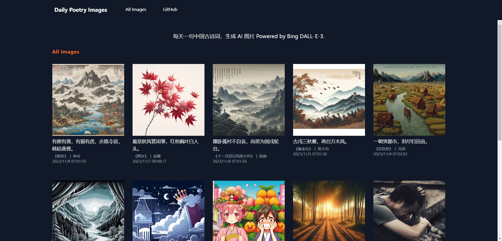
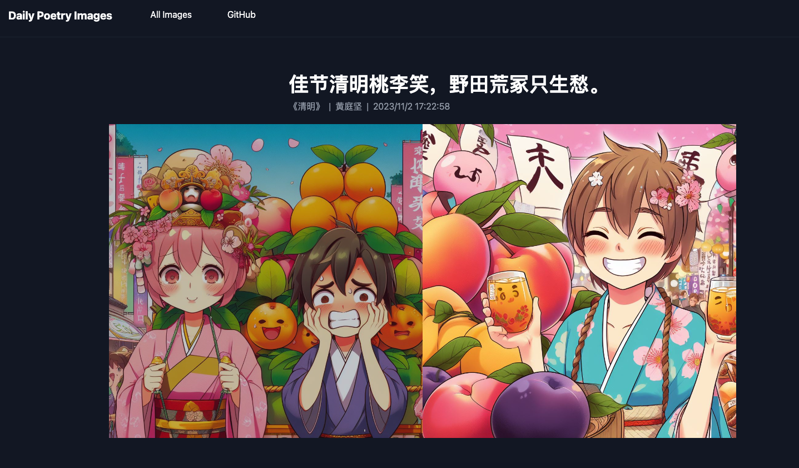
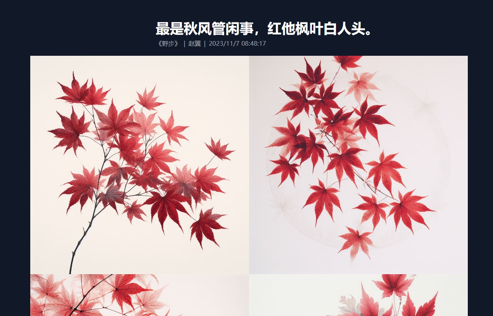

## daily-poetry-image

每天一句中国古诗词，生成 AI 图片 Powered by Bing DALL-E-3.

### 👉🏽 [Live Demo](https://daily-poetry-image.vercel.app/)

## 项目介绍

-   本项目是基于 [Bing Image DALL-E-3](https://www.bing.com/images/create) 生成的图片，每天一句中国古诗词作为 Prompt。
-   GitHub Action 自动触发。
-   诗词由[今日诗词](https://www.jinrishici.com/)提供 API。
-   网站使用 [Astro](https://astro.build) 构建。

## 文章
- [每天一句中国古诗词，通过 Bing DALL-E-3 生成 AI 图片](https://liruifengv.com/posts/daily-poetry-image)

## 订阅

你可以使用 RSS 订阅每天的诗词配图：https://daily-poetry-image.vercel.app/rss.xml

[如何用 RSS 订阅？](https://zhuanlan.zhihu.com/p/55026716)

## 截图

## 灵感来源

-   [yihong0618/2023](https://github.com/yihong0618/2023)

## Star History

<a href="https://star-history.com/#liruifengv/daily-poetry-image&Date">
  <picture>
    <source media="(prefers-color-scheme: dark)" srcset="https://api.star-history.com/svg?repos=liruifengv/daily-poetry-image&type=Date&theme=dark" />
    <source media="(prefers-color-scheme: light)" srcset="https://api.star-history.com/svg?repos=liruifengv/daily-poetry-image&type=Date" />
    
  </picture>
</a>

## License

MIT
